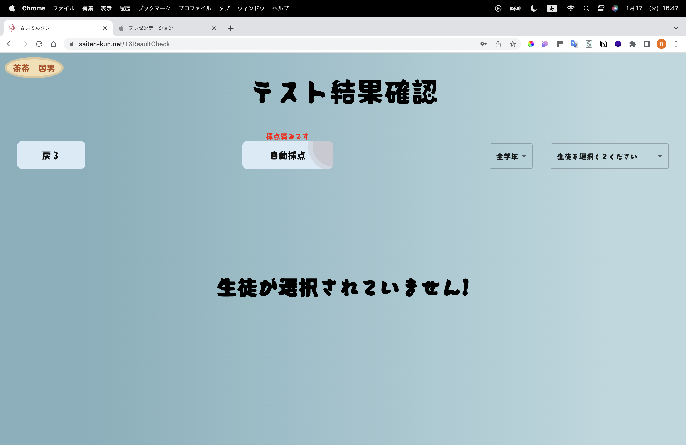

# さいてんクン

小学校の先生のテスト自動作成、採点業務を効率化する web アプリ(デモアプリです)

[アプリリンク](https://saiten-kun.net)

## アプリ詳細

- 本アプリの機能はおおきく分けて２種類
  _ 先生機能 
  ┗ 生徒新規登録 
  ┗ テスト問題自動作成 
  ┗ テスト採点 
  _ 生徒機能 
  ┗ テスト開始 
  ┗ 今までのテスト 
   
- テストは ChatGPT により自動作成
- 生徒の手書き文字を手書き文字認識 AI によりテキスト化し自動採点を実施
 
 
 
## アプリの使い方(先生側)

### 生徒の新規登録
  

  

  　ログイン⇨生徒新規登録⇨必要情報入力⇨生徒一覧で登録を確認

 
 

### テストの作成
  

  

  　ログイン⇨テスト作成⇨テストの科目等を選択⇨登録ボタンを押下

 
 

### テストの開始
  

  

  　ログイン⇨テスト一覧⇨テストを選択して時間をセット後、「テスト開始」を押下

 
 

### テストの採点
  

  

  　
  ログイン⇨テスト一覧⇨採点したいテストを選択⇨「自動採点」をクリック⇨成績を見たい生徒を選択

 
 
 

## アプリの使い方（生徒側）

### テストの開始
  

  

  ※先生のテスト開始後 
  ログイン⇨テスト開始を選択⇨出題されたテストを解く⇨右上の提出を選択しOKを押下
 
 

### テストの結果確認
  

  

  ※先生のテスト採点後 
  ログイン⇨今までのテストを選択⇨テストを選択しテスト結果確認を押下⇨自分の点数を確認
 
 
 
 

## 使用している技術
* フロントエンド 
  ┗React 
   　 ┗ react-router(ルーティングライブラリ) 
    　┗ recoil(ステート管理ライブラリ) 
    　┗ react-three-fiber(3Dアニメーションライブラリ) 
    　┗ MaterialUi(UIコンポーネントライブラリ) 
    　┗react-rewards(紙吹雪アニメーションライブラリ) 
  ┗webAPI 
    　┗ChatGPT(自然言語処理モデルAI-テスト作成に使用) 
    　┗UserLocal(手書き文字認識AI) 
 
 

## 注意事項
* ChatGPTはライセンス制限により問題作成に制限がかかる可能性があります。 
* UserLocalの文字認識AIのAPIは現在1000回/24hの制限があります。 

## 文責

* 作成者 kazu006 Tera-saka Yusuke333 riiiiion
* 所属　Taylor

